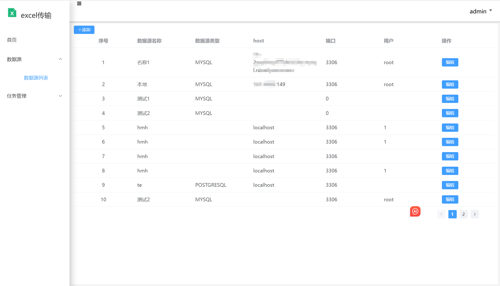

# excel2db
## 简介
excel2db是一个将excel文件转换为数据库的工具，目前支持mysql、postgresql、oracle、sqlserver。
1、前端采用vue3、element-plus构建
2、后端采用java21、springboot3、mybatis3构建
3、数据存储在mysql中
> 注意：目前只支持单表导入，不支持多表导入；仅mysql传输进行测试
## 功能
1、数据源管理

2、任务管理

## 后续计划
数据源
转换插件
docker部署